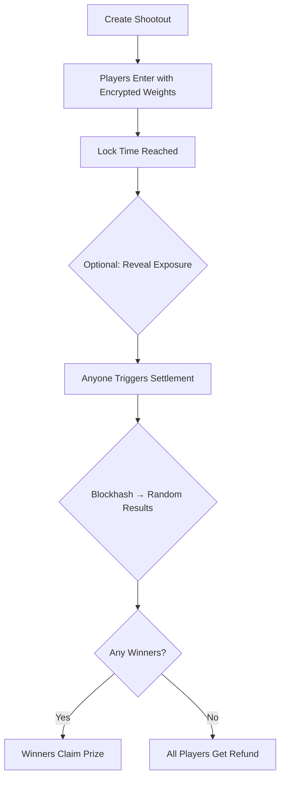

# AuroraPenaltyGrid

> **Privacy-Preserving Penalty Shootout Prediction Market powered by Zama FHE**

[](https://opensource.org/licenses/MIT)
[](https://soliditylang.org/)
[](https://hardhat.org/)
[](https://reactjs.org/)
[](https://docs.zama.ai/fhevm)

**AuroraPenaltyGrid** is a decentralized penalty shootout prediction game where users predict the outcomes (Goal/Save) of multiple penalty kicks with **fully encrypted confidence weights**. All predictions remain private until settlement, ensuring fairness and preventing gaming. Settlement is triggered on-chain using verifiable randomness, eliminating the need for trusted oracles or admin intervention.

---

## 📑 Table of Contents

- [Overview](#-overview)
- [Key Features](#-key-features)
- [How It Works](#-how-it-works)
- [Game Mechanics](#-game-mechanics)
- [Privacy & Security](#-privacy--security)
- [System Architecture](#-system-architecture)
- [Technology Stack](#-technology-stack)
- [Getting Started](#-getting-started)
- [Smart Contract API](#-smart-contract-api)
- [Frontend Integration](#-frontend-integration)
- [Testing](#-testing)
- [Deployment](#-deployment)
- [Roadmap](#-roadmap)
- [Contributing](#-contributing)
- [License](#-license)

---

## 🌟 Overview

Traditional prediction markets suffer from transparency issues where early bets can influence later participants, creating unfair advantages. **AuroraPenaltyGrid** solves this using **Fully Homomorphic Encryption (FHE)** from Zama's fhEVM, ensuring:

- 🔒 **Complete Privacy**: All predictions and confidence weights are encrypted on-chain
- ⚖️ **Provable Fairness**: Settlement uses deterministic on-chain randomness (blockhash)
- 🎯 **Zero Trust**: No admin or oracle can manipulate results
- 💎 **Transparent Exposure**: Optional aggregate statistics reveal overall trends without exposing individuals

### Problem Statement

In conventional prediction markets:
- Early participants can see aggregate betting trends
- Late entrants gain unfair information advantages
- Operators can front-run or manipulate outcomes
- Trust in the platform is centralized

### Our Solution

AuroraPenaltyGrid leverages Zama's **fhEVM** to enable:
1. **Encrypted Predictions**: All picks and weights stored as `euint64` on-chain
2. **Privacy-Preserving Aggregation**: Total exposure calculated without revealing individuals
3. **Decentralized Settlement**: Blockhash-based randomness triggers fair outcome generation
4. **Verifiable Fairness**: All operations are auditable and trustless

---

## ✨ Key Features

| Feature | Description |
|---------|-------------|
| **Permissionless Creation** | Anyone can create a shootout with custom kicks, entry fee, and duration |
| **FHE-Encrypted Betting** | Confidence weights encrypted using Zama fhEVM SDK (never revealed) |
| **Adjustable Predictions** | Modify picks before lock time without exposing strategy |
| **Optional Exposure Reveal** | Request aggregate statistics post-lock (encrypted totals decrypted) |
| **Automated Settlement** | Blockhash-based deterministic randomness generates results |
| **Prize Distribution** | Winners (perfect predictions) split the prize pool automatically |
| **Refund Mechanism** | Full refunds for cancelled shootouts or no-winner scenarios |
| **Gas Optimized** | ~300k gas for entry, ~200k gas for shootout creation |
| **Mobile Responsive** | PWA-ready frontend with optimized UX |

---

## 🎮 How It Works

### Step-by-Step Flow



### 1. **Shootout Creation**
- Creator defines:
  - **Shootout ID**: Unique identifier
  - **Entry Fee**: Minimum 0.0005 ETH
  - **Duration**: 1-10 days until lock
  - **Kicks**: 3-12 penalty kicks with custom labels

```solidity
createReplicaShootout(
    "champions-final-2025",
    0.001 ether,
    7 days,
    ["Kick 1", "Kick 2", "Kick 3", "Kick 4", "Kick 5"]
);
```

### 2. **Player Participation**
- Players predict each kick (0 = Goal, 1 = Save)
- Encrypt confidence weight using fhEVM SDK
- Submit encrypted weight + ZK proof
- Pay entry fee (added to prize pool)

```solidity
enterReplicaShootout(
    shootoutId,
    [0, 1, 0, 1, 0], // Goal, Save, Goal, Save, Goal
    encryptedWeight,  // euint64 from fhEVM SDK
    proof             // ZK proof for validity
);
```

### 3. **Privacy-Preserving Aggregation**
- Contract maintains encrypted totals: `picksGoal[i]`, `picksSave[i]`
- Uses `FHE.add()` to update aggregates without decryption
- Nobody can see individual choices or overall trends

### 4. **Optional Exposure Reveal** (Post-Lock)
- Anyone can request decryption of aggregate stats
- Callback reveals totals: `revealedGoal[i]`, `revealedSave[i]`
- Individuals remain private; only aggregates shown

### 5. **Settlement**
- After lock time, anyone can call `settleReplicaShootout()`
- Uses `blockhash` of future block as entropy source
- Derives deterministic result for each kick (Goal/Save)
- Identifies winners who predicted all kicks correctly

### 6. **Prize Distribution**
- **Winners exist**: Prize pool split equally among them
- **No winners (pushAll)**: All participants get full refunds
- **Cancelled**: Automatic refunds for all

---

## 🎯 Game Mechanics

### Entry Requirements
- ✅ Entry fee ≥ contract minimum (0.0005 ETH)
- ✅ Pick count matches kick count
- ✅ Each pick is binary (0 or 1)
- ✅ Encrypted weight provided with valid proof
- ✅ Entry before lock time

### Prediction Adjustment
Players can modify predictions before lock:
```solidity
adjustReplicaEntry(shootoutId, newPicks, newEncryptedWeight, newProof);
```
- Updates FHE-encrypted totals (subtract old, add new)
- Maintains complete privacy throughout

### Settlement Logic
```javascript
For each kick i:
    seed = keccak256(blockhash, shootoutId, i)
    result[i] = (seed % 2 == 0) ? GOAL : SAVE

winners = players who predicted all results correctly
```

### Prize Calculation
```
Prize per winner = (Total Prize Pool) / (Number of Winners)
```

### Refund Scenarios
1. **Shootout cancelled by creator**
2. **No winners (pushAll = true)**
3. **Partial refunds not supported** (all-or-nothing design)

---

## 🔐 Privacy & Security

### FHE Privacy Guarantees

| Data | Storage Type | Visibility |
|------|--------------|------------|
| Individual Picks | Plaintext (uint8[]) | Public after entry |
| Confidence Weight | `euint64` | **Private** (encrypted) |
| Aggregate Exposure | `euint64` | **Private** until reveal |
| Revealed Totals | `uint64` | Public post-reveal |

### Why FHE Matters

**Traditional Approach**:
```
Player A bets → Visible on-chain → Player B sees trend → Adjusts strategy
```

**FHE Approach**:
```
Player A bets → Encrypted → Player B cannot see → Fair competition
```

### Security Model

1. **Encrypted Storage**: All weights stored as `euint64` using Zama's FHE
2. **ZK Proofs**: Client-side proof generation prevents invalid encrypted data
3. **Access Control**: `FHE.allow()` grants weight decryption only to owner
4. **Deterministic Randomness**: Blockhash ensures verifiable, un-manipulable outcomes
5. **No Reentrancy**: Follows Checks-Effects-Interactions pattern
6. **No Integer Overflow**: Solidity 0.8+ built-in checks

### Threat Model

| Attack Vector | Mitigation |
|---------------|------------|
| Front-running bets | FHE encryption hides values |
| Oracle manipulation | On-chain blockhash randomness |
| Admin bias | No admin privileges in settlement |
| Data exposure | Encrypted until explicit reveal |
| Reentrancy | CEI pattern + single state changes |

---

## 🏗 System Architecture

### High-Level Architecture

```
┌─────────────────────────────────────────────────────────┐
│                      Frontend (React)                    │
│  ┌──────────┐  ┌──────────┐  ┌──────────┐             │
│  │ Shootout │  │  Betting │  │   Prize  │             │
│  │   Hall   │  │  Sheet   │  │  Claims  │             │
│  └──────────┘  └──────────┘  └──────────┘             │
└─────────────────┬───────────────────────────────────────┘
                  │ Wagmi + RainbowKit
                  │ fhEVM SDK (Encryption)
                  ▼
┌─────────────────────────────────────────────────────────┐
│              Smart Contract (Solidity)                   │
│  ┌────────────────────────────────────────────────────┐ │
│  │         AuroraPenaltyGrid.sol                      │ │
│  │  • createReplicaShootout()                        │ │
│  │  • enterReplicaShootout()                         │ │
│  │  • adjustReplicaEntry()                           │ │
│  │  • settleReplicaShootout()                        │ │
│  │  • claimPrize() / claimRefund()                   │ │
│  └────────────────────────────────────────────────────┘ │
└─────────────────┬───────────────────────────────────────┘
                  │ FHE Operations
                  ▼
┌─────────────────────────────────────────────────────────┐
│              Zama fhEVM (Layer)                          │
│  • euint64 encrypted storage                            │
│  • FHE.add / FHE.sub operations                         │
│  • Decryption request/callback                          │
│  • ZK proof verification                                │
└─────────────────────────────────────────────────────────┘
```

### Data Flow Diagram

```
User Input              Frontend              Smart Contract           FHE Layer
─────────              ────────              ──────────────           ─────────
   │                       │                       │                     │
   │ Enter prediction      │                       │                     │
   ├──────────────────────>│                       │                     │
   │                       │ Generate encrypted    │                     │
   │                       │ weight with SDK       │                     │
   │                       ├──────────────────────>│                     │
   │                       │                       │ Store euint64       │
   │                       │                       ├────────────────────>│
   │                       │                       │                     │
   │                       │                       │ Update aggregates   │
   │                       │                       │ (FHE.add)          │
   │                       │                       ├────────────────────>│
   │                       │<──────────────────────┤                     │
   │<──────────────────────┤ Transaction success   │                     │
   │                       │                       │                     │
```

### Smart Contract Architecture

```
AuroraPenaltyGrid
├── Structs
│   ├── ReplicaShootout     // Shootout metadata
│   │   ├── entryFee
│   │   ├── lockTime
│   │   ├── prizePool
│   │   ├── cancelled
│   │   ├── settled
│   │   └── pushAll
│   │
│   ├── ReplicaEntry        // Player entry
│   │   ├── exists
│   │   ├── claimed
│   │   ├── picks[]
│   │   └── weightCipher (euint64)
│   │
│   └── ReplicaKicks        // Kick metadata
│       ├── labels[]
│       ├── picksGoal[] (euint64)
│       └── picksSave[] (euint64)
│
├── Core Functions
│   ├── createReplicaShootout()
│   ├── enterReplicaShootout()
│   ├── adjustReplicaEntry()
│   ├── settleReplicaShootout()
│   ├── claimPrize()
│   └── claimRefund()
│
├── View Functions
│   ├── getReplicaShootout()
│   ├── getReplicaEntry()
│   ├── getReplicaKicks()
│   └── listReplicaShootouts()
│
└── FHE Operations
    ├── FHE.asEuint64() (conversion)
    ├── FHE.add()       (aggregation)
    ├── FHE.sub()       (adjustment)
    └── FHE.allow()     (access control)
```

---

## 🛠 Technology Stack

### Smart Contracts

| Component | Version | Purpose |
|-----------|---------|---------|
| Solidity | 0.8.24 | Smart contract language |
| Hardhat | 2.19.5 | Development environment |
| Zama fhEVM | Latest | FHE encryption library |
| OpenZeppelin | 5.x | Security patterns |

### Frontend

| Component | Version | Purpose |
|-----------|---------|---------|
| React | 18.3.1 | UI framework |
| TypeScript | 5.6.3 | Type safety |
| Vite | 5.4.10 | Build tool (HMR) |
| Wagmi | 2.x | Ethereum hooks |
| RainbowKit | 2.x | Wallet connection |
| Tailwind CSS | 3.x | Styling |
| Shadcn UI | Latest | Component library |
| fhevmjs | 0.5.x | FHE SDK |

### Infrastructure

| Component | Purpose |
|-----------|---------|
| Sepolia Testnet | Zama fhEVM deployment |
| Vercel | Frontend hosting |
| Etherscan | Contract verification |
| IPFS | Decentralized metadata (future) |

---

## 🚀 Getting Started

### Prerequisites

```bash
node >= 18.0.0
npm >= 9.0.0
```

### Installation

1. **Clone the repository**
```bash
git clone https://github.com/yourusername/AuroraPenaltyGrid.git
cd AuroraPenaltyGrid
```

2. **Install dependencies**
```bash
# Install contract dependencies
npm install

# Install frontend dependencies
cd frontend
npm install
cd ..
```

3. **Configure environment**
```bash
# Root directory
cp .env.example .env

# Frontend directory
cp frontend/.env.example frontend/.env
```

Edit `.env` files with your configuration:
```env
# Root .env
SEPOLIA_RPC_URL=https://ethereum-sepolia-rpc.publicnode.com
PRIVATE_KEY=your_deployer_private_key

# frontend/.env
VITE_AURORA_PENALTY_GRID_ADDRESS=deployed_contract_address
VITE_CHAIN_ID=11155111
```

### Compile Contracts

```bash
npx hardhat compile
```

### Run Tests

```bash
# Run all tests
npx hardhat test

# Run specific test suite
npx hardhat test test/AuroraPenaltyGrid.test.js

# Run with gas reporting
REPORT_GAS=true npx hardhat test

# Generate coverage report
npx hardhat coverage
```

### Deploy to Sepolia

```bash
SEPOLIA_RPC_URL="your_rpc_url" npx hardhat run scripts/deploy.cjs --network sepolia
```

### Start Frontend

```bash
cd frontend
npm run dev
```

Visit `http://localhost:5173`

---

## 📚 Smart Contract API

### Core Functions

#### `createReplicaShootout`
```solidity
function createReplicaShootout(
    string calldata shootoutId,
    uint256 entryFee,
    uint256 duration,
    string[] calldata kickLabels
) external;
```
Creates a new penalty shootout.

**Parameters:**
- `shootoutId`: Unique identifier
- `entryFee`: Entry fee in wei (≥ 0.0005 ETH)
- `duration`: Time until lock (1-10 days in seconds)
- `kickLabels`: Array of kick labels (3-12 items)

**Requirements:**
- Entry fee ≥ `MIN_ENTRY_FEE`
- Duration between 1 and 10 days
- Kick count between 3 and 12
- Shootout ID must be unique

---

#### `enterReplicaShootout`
```solidity
function enterReplicaShootout(
    string calldata shootoutId,
    uint8[] calldata picks,
    bytes calldata encryptedWeight,
    bytes calldata proof
) external payable;
```
Enter a shootout with encrypted confidence weight.

**Parameters:**
- `shootoutId`: Target shootout
- `picks`: Array of predictions (0=Goal, 1=Save)
- `encryptedWeight`: FHE-encrypted weight (from fhEVM SDK)
- `proof`: ZK proof for encrypted weight

**Requirements:**
- Correct entry fee (msg.value)
- Before lock time
- Pick count matches kick count
- Each pick is 0 or 1
- Not already entered

---

#### `adjustReplicaEntry`
```solidity
function adjustReplicaEntry(
    string calldata shootoutId,
    uint8[] calldata newPicks,
    bytes calldata newEncryptedWeight,
    bytes calldata newProof
) external;
```
Modify existing entry before lock time.

---

#### `settleReplicaShootout`
```solidity
function settleReplicaShootout(
    string calldata shootoutId,
    uint256 randomSeed
) external;
```
Trigger settlement using blockhash-based randomness.

**Parameters:**
- `shootoutId`: Target shootout
- `randomSeed`: Block number for entropy (must be in valid range)

**Settlement Logic:**
```solidity
for (uint i = 0; i < kickCount; i++) {
    bytes32 hash = keccak256(abi.encodePacked(
        blockhash(randomSeed),
        shootoutId,
        i
    ));
    results[i] = (uint8(hash[0]) % 2 == 0) ? GOAL : SAVE;
}
```

---

#### `claimPrize`
```solidity
function claimPrize(string calldata shootoutId) external;
```
Claim prize for winning entry (perfect prediction).

**Requirements:**
- Shootout is settled
- Caller is a winner
- Not already claimed

---

#### `claimRefund`
```solidity
function claimRefund(string calldata shootoutId) external;
```
Claim refund for cancelled or no-winner shootout.

---

### View Functions

#### `getReplicaShootout`
```solidity
function getReplicaShootout(string calldata shootoutId)
    external view returns (
        uint256 entryFee,
        uint256 lockTime,
        uint256 prizePool,
        bool cancelled,
        bool settled,
        bool pushAll,
        uint256 winnerCount
    );
```

#### `getReplicaEntry`
```solidity
function getReplicaEntry(string calldata shootoutId, address user)
    external view returns (
        bool exists,
        bool claimed,
        uint8[] memory picks
    );
```

#### `getReplicaKicks`
```solidity
function getReplicaKicks(string calldata shootoutId)
    external view returns (
        string[] memory labels,
        uint64[] memory revealedGoal,
        uint64[] memory revealedSave
    );
```

#### `listReplicaShootouts`
```solidity
function listReplicaShootouts()
    external view returns (string[] memory);
```

---

## 🎨 Frontend Integration

### Initialize fhEVM SDK

```typescript
import { createFhevm } from "fhevmjs";

const fhevmInstance = await createFhevm({
  chainId: 11155111, // Sepolia
  publicKey: await contract.getPublicKey(),
});
```

### Encrypt Confidence Weight

```typescript
const weight = 80; // 0-100 confidence
const encrypted = fhevmInstance.encrypt64(weight);

await contract.enterReplicaShootout(
  shootoutId,
  picks,
  encrypted.data,
  encrypted.proof,
  { value: entryFee }
);
```

### Listen for Events

```typescript
contract.on("ShootoutSettled", (shootoutId, results) => {
  console.log(`Shootout ${shootoutId} settled:`, results);
  // Refresh UI
});

contract.on("PrizeClaimed", (shootoutId, winner, amount) => {
  console.log(`${winner} claimed ${amount} from ${shootoutId}`);
});
```

### React Hooks Example

```typescript
import { useWaitForTransactionReceipt } from "wagmi";

const { hash, isPending, isSuccess } = useEnterShootout();

useEffect(() => {
  if (hash) {
    toast.loading("Transaction submitted...", {
      id: hash,
      description: (
        <a href={`https://sepolia.etherscan.io/tx/${hash}`}>
          View on Etherscan
        </a>
      ),
    });
  }
}, [hash]);
```

---

## 🧪 Testing

### Test Coverage

| Test Suite | Test Cases | Status |
|------------|------------|--------|
| Unit Tests | 28 | ✅ |
| Integration Tests | 17 | ✅ |
| **Total** | **45** | ✅ |

### Run Tests

```bash
# All tests
npx hardhat test

# Specific suite
npx hardhat test test/AuroraPenaltyGrid.test.js

# With coverage
npx hardhat coverage
```

### Test Structure

```
test/
├── AuroraPenaltyGrid.test.js   # Unit tests (28 cases)
├── Integration.test.js          # Integration tests (17 cases)
└── README.md                    # Test documentation
```

See [test/README.md](test/README.md) for detailed testing guide.

---

## 🌐 Deployment

### Sepolia Testnet

**Contract Address**: `0xe2F42146646CBe30E2Cbeab4A5F9D888E22AC67e`
**Network**: Sepolia (Chain ID: 11155111)
**Explorer**: [View on Etherscan](https://sepolia.etherscan.io/address/0xe2F42146646CBe30E2Cbeab4A5F9D888E22AC67e)

### Deployment Steps

1. **Deploy Contract**
```bash
npx hardhat run scripts/deploy.cjs --network sepolia
```

2. **Create Test Shootouts**
```bash
npx hardhat run scripts/create-shootouts-ethers.cjs --network sepolia
```

3. **Update Frontend Config**
```typescript
// frontend/src/config/contracts.ts
export const AURORA_PENALTY_GRID_ADDRESS = "0xe2F42...";
```

4. **Deploy Frontend**
```bash
cd frontend
npm run build
vercel --prod
```

### Mainnet Deployment Checklist

- [ ] Complete security audit
- [ ] Extensive testnet testing (100+ users)
- [ ] Gas optimization review
- [ ] Emergency pause mechanism (if needed)
- [ ] Multi-sig admin setup
- [ ] Insurance fund allocation
- [ ] Legal compliance review
- [ ] Bug bounty program launch

---

## 🗺 Roadmap

### Phase 1: Foundation ✅ (Current)

- [x] Core smart contract with FHE
- [x] Basic frontend UI
- [x] Sepolia testnet deployment
- [x] Comprehensive test suite
- [x] Documentation

### Phase 2: Enhancement 🚧 (Q4 2025)

- [ ] **Oracle Integration**
  - Chainlink VRF for enhanced randomness
  - Chainlink Price Feeds for dynamic fees

- [ ] **Advanced Features**
  - Multi-currency support (USDC, DAI)
  - Shootout templates (World Cup, Champions League)
  - Leaderboards and achievements
  - NFT trophies for winners

- [ ] **UX Improvements**
  - Mobile app (React Native)
  - Push notifications
  - Social sharing
  - Tutorial mode

### Phase 3: Decentralization 🔮 (Q1 2026)

- [ ] **DAO Governance**
  - Community voting on parameters
  - Proposal system for new features
  - Treasury management

- [ ] **Cross-Chain Expansion**
  - Bridge to other FHE-enabled chains
  - Multi-chain shootout synchronization

- [ ] **Advanced Analytics**
  - Historical data dashboards
  - ML-based trend analysis (privacy-preserving)
  - API for third-party integrations

### Phase 4: Ecosystem 🌍 (Q2 2026)

- [ ] **White-Label Solution**
  - SDK for other sports/games
  - Customizable frontend templates

- [ ] **Partnerships**
  - Integration with sports betting platforms
  - Collaboration with esports organizations

- [ ] **Enterprise Features**
  - Private shootouts for organizations
  - Custom branding options
  - SLA guarantees

---

## 🤝 Contributing

We welcome contributions! Please follow these guidelines:

### Development Process

1. **Fork the repository**
2. **Create a feature branch**
   ```bash
   git checkout -b feature/your-feature-name
   ```
3. **Make your changes**
   - Write tests for new features
   - Follow existing code style
   - Update documentation
4. **Run tests**
   ```bash
   npx hardhat test
   npm run lint
   ```
5. **Commit with conventional commits**
   ```bash
   git commit -m "feat: add new shootout filter"
   ```
6. **Push and create PR**
   ```bash
   git push origin feature/your-feature-name
   ```

### Code Style

- **Solidity**: Follow [Solidity Style Guide](https://docs.soliditylang.org/en/latest/style-guide.html)
- **TypeScript/React**: Use ESLint + Prettier
- **Commits**: Use [Conventional Commits](https://www.conventionalcommits.org/)

### Areas for Contribution

- 🐛 Bug fixes
- ✨ New features
- 📝 Documentation improvements
- 🧪 Test coverage expansion
- 🎨 UI/UX enhancements
- 🌐 Internationalization
- ⚡ Gas optimization

---

## 📄 License

This project is licensed under the **MIT License** - see the [LICENSE](LICENSE) file for details.

---

## 🙏 Acknowledgments

- **Zama** for fhEVM and FHE technology
- **Hardhat** team for excellent dev tools
- **OpenZeppelin** for security libraries
- **Wagmi & RainbowKit** for Web3 abstractions
- **Shadcn UI** for component library
- Community contributors and testers

---

## 📞 Support & Community

- **GitHub Issues**: [Report bugs](https://github.com/yourusername/AuroraPenaltyGrid/issues)
- **Discussions**: [Community forum](https://github.com/yourusername/AuroraPenaltyGrid/discussions)
- **Twitter**: [@AuroraPenaltyGrid](#)
- **Discord**: [Join our server](#)
- **Email**: support@aurorapenaltygrid.io

---

## ⚠️ Disclaimer

This is experimental software for educational purposes. Use at your own risk. Not financial advice. Always do your own research before participating in any blockchain-based prediction market.

---

<div align="center">

**Built with ❤️ using Zama FHE**

[Website](#) • [Documentation](#) • [Twitter](#) • [Discord](#)

</div>
